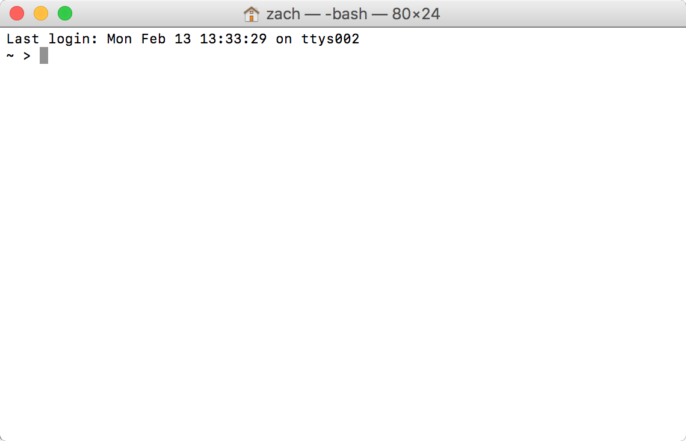
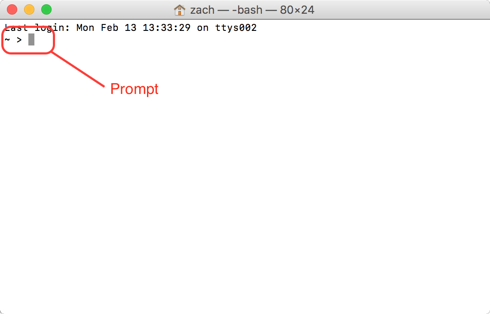
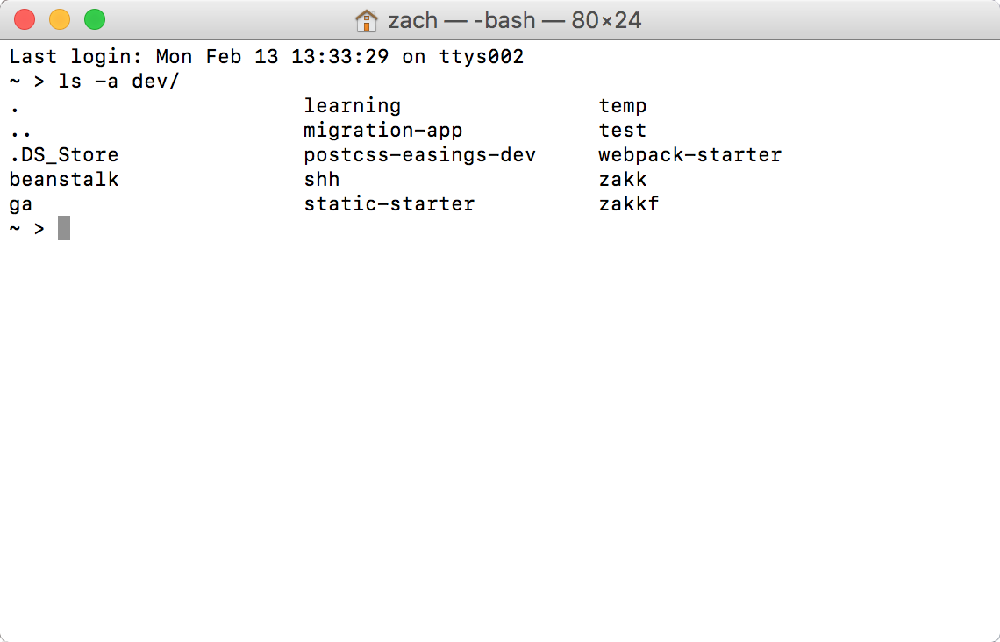
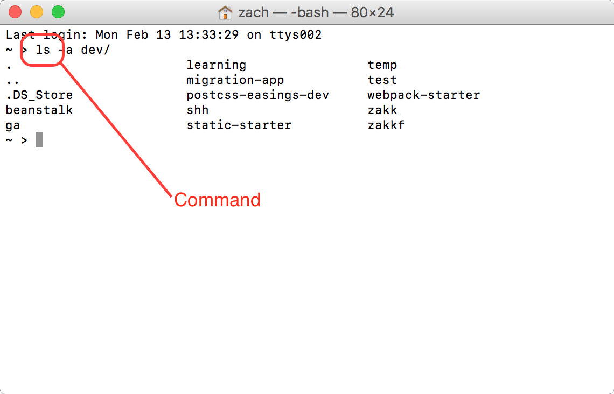
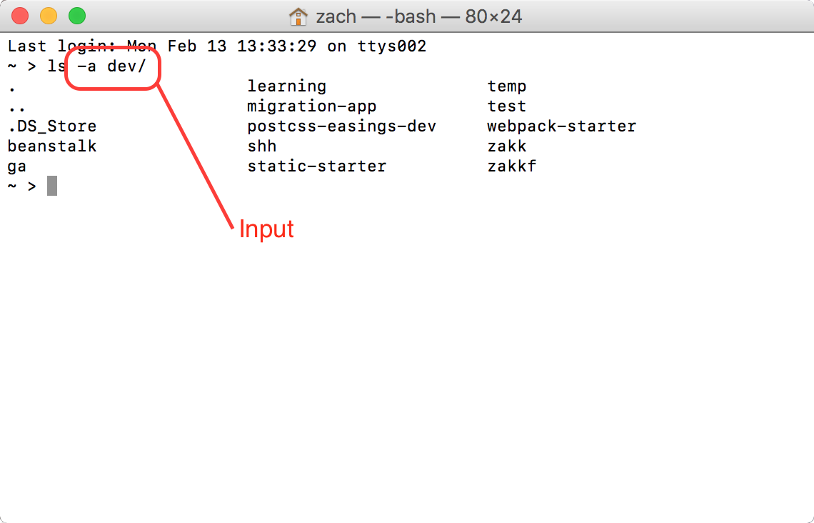
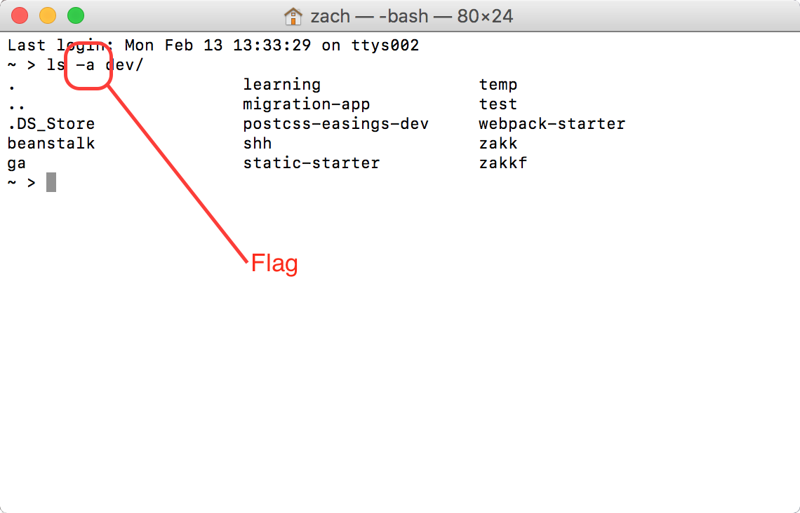
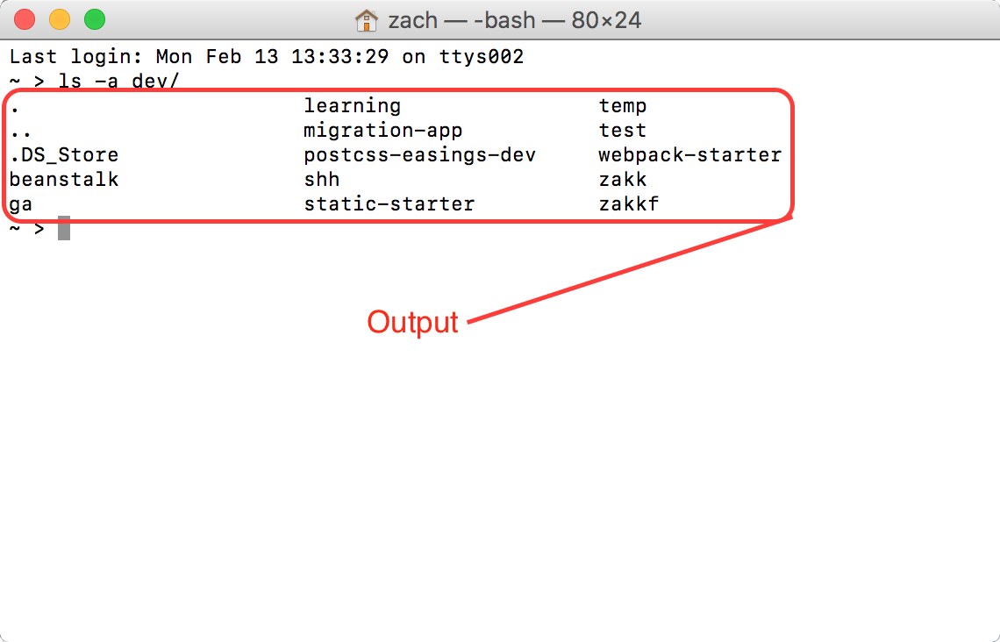

## Class 01: The Command Line

---

### Agenda

| Timing | Topic                                    |
| ------ | ---------------------------------------- |
| 5  min | Check In                                 |
| 40 min | Introducing the Terminal                 |
| 20 min | Activity: Scavenger Hunt                 |
| 10 min | Break                                    |
| 60 min | Git and GitHub                           |
| 10 min | Break                                    |
| 50 min | Git and GitHub (cont'd)                  |
| 10 min | Closing                                  |
| 5  min | Check Out                                |

---
### Learning Goals
* Navigate using the terminal
* Manage a local repository in Git
* Fork a repository
* Clone a repository
* Make a pull request on a repository

---
## The Terminal

--
### What is the Terminal?
- tool for navigating the file system on our computer

--
### Why use it?
1. Concise and powerful
2. Efficient
3. Requires fewer resources
4. Expert-friendly
5. Easy to automate via scripting

--
### Anatomy of the Terminal

--
#### The Terminal

--
#### The Terminal

--
#### The Terminal

--
#### The Terminal

--
#### The Terminal

--
#### The Terminal

--
### Terminal Anatomy

| Part        | Description                       |
| ----------- | --------------------------------- |
| Prompt      | Where you enter commands          |
| Command     | Text to be executed               |
| Input       | Options and Data for the command  |
| Flag/Option | Specific data for a given command |
| Output      | What the command returns          |

--
### Code Along!
Open your Terminal and follow along

--
### Unstructured Review
- practice navigating around your computer using the command line
- try each command at least 5 times

--
### Navigating the Command Line

| Command       | Description                                |
| -----------   | ------------------------------------------ |
| **`pwd`**     | **P**rint **w**orking **d**irectory        |
| **`ls`**      | **L**i**s**t the contents of the directory |
| **`cd`**      | **C**hange **d**irectories                 |
| `cd myFolder` | go into myFolder                           |
| `cd ../`      | go up one folder/directory                 |
| `cd ..`       | shorthand for `cd ../`                     |

--
### Paths and Directories

| Path     | Description        |
| -------- | -----------------  |
| `./`     | current directory  |
| `../`    | up one directory   |
| `../../` | up two directories |
| `/`      | root directory     |
| `~/`     | 'home' directory   |

--
### Working with Files and Folders
| Command     | Description                                |
| ----------- | ------------------------------------------ |
| `mkdir`     | **M**a**k**e **dir**ectory                 |
| `rmdir`     | **R**e**m**ove empty **dir**ectories       |
| `rm`        | **R**e**m**ove files or directories        |
| `mv`        | **m**o**v**e file or directory             |
| `cp`        | **c**o**p**y file or directory             |
| `touch`     | Create an empty file                       |
| `echo`      | Return a string                            |

--
## Break

---
## Terminal Review

--
### Terminal Review
- Count off 1-4 and find a corner of the room
- A question or command will come up on the board
- Go around your group answering the question or explaining what the command does

--
### `pwd`

--
### How to I create a folder through the command line?

--
### `rm -rf test-directory`

--
### `mv test-directory/* dir02/`

--
### What is a relative path?

--
### `touch test.js`

--
### `cp test-directory/* dir02/`

--
### What is an absolute path?

--
## Done!
Great job!

---
## Git and GitHub

--
### Overview
- Git: Version Control System
- GitHub: Saas tool for working with Git

--
### Version Control System

--
### Git Overview
- Creating and working with a repository
- Forking a repository
- Cloning a repository

--
### 20,000 Feet
What is Version Control and how does it work?

--
### Key terms

| Term  | Definition |
| ----- | ---------- |
| repository | Folder where git manages changes and history |
| local | the version of the repository on your machine |
| remote/origin | a shared version of the repository hosted on a server |
| fork | a snapshot or copy of a repository |
| pull request | submitting changes from a fork to be merged |
| upstream | The original repository of a forked repository |

--
### Code Along!

--
## Git Commands
| Command                     | Description                               |
| --------------------------- | ----------------------------------------- |
| `git init`                  | Initializes a new repository              |
| `git add`                   | Stages a set of files to be committed     |
| `git add .`                 | Stages all modified files                 |
| `git add myFile.js`         | Stages a specific file                    |
| `git commit -m "my commit"` | Commits staged files to the repository    |
| `git push origin master`    | Pushes commits to master branch of origin |

---
## Scavenger Hunt

--
### Scavenger Hunt
- **Copy** at least 5 rubies into your stash
- Can't include any trees!

https://github.com/ga-students/js_dc_scavenger_hunt/blob/master/readme.md
