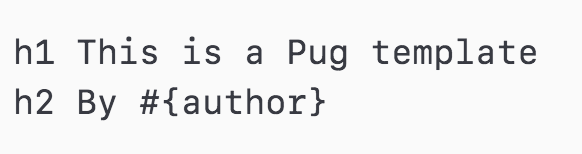
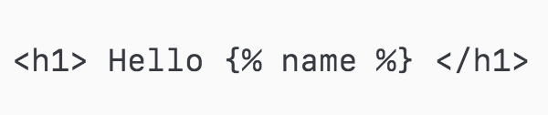
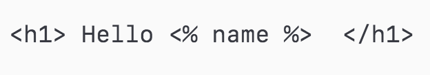
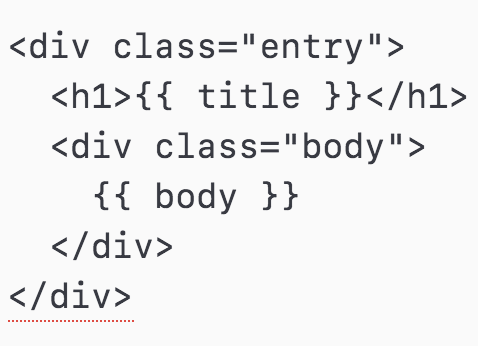
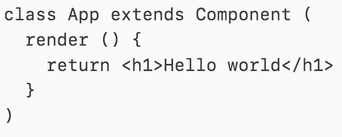

## Class 09: Templating

---
### Agenda
| Timing | Topic                                    |
| ------ | ---------------------------------------- |
| 5  min | Check In                                 |
| 20 min | Review                                   |
| 30 min | Warmup                                   |
| 10 min | WTF is jQuery                            |
| 80 min | Intro to Templating                      |
| 30 min | Closing Exercise                         |
| 15 min | Final Project                            |
| 5  min | Closing Questions & Exit Ticket          |

---
## Looking Ahead

| Lesson No. |        Topic             |
| ---------- | ------------------------ |
|     07     | Intro to the DOM         |
|     08     | Events                   |
|   **09**   | **Templating**           |
|     10     | Express                  |
|     11     | Databases & CRUD         |
|     11     | APIs                     |
|     12     | Application Architecture |
|     13     | Lab #2                   |

---
## Homework Review

---
## jQuery

--
### jQuery: Pros
- easy/simple interface for working with the DOM
- builds jQuery objects with a ton of helpful and easy to use methods
- truly incredible cross browser support

--
### jQuery: Cons
- it's big and slow
- makes it difficult to actually learn JavaScript
- promotes a not great way of thinking about the DOM and building web applications

---
## Warmup Exercise
Refactor slideshow to respond to events

---
## Templating

--
### Templating: A Brief Introduction
- Break up an `html` page into components or partials
- Dynamically build out entire `html` pages
- Bring functionality to our markup

--
### Types of Templating Languages/Engines
3 Flavors of templating:
- Jade / Pug
- Nunjucks / Swig ( EJS, sort of )
- Handlebars / Mustache

--
### Jade / Pug

--
### Nunjucks / Swig

--
### EJS

--
### Handlebars / Mustache

--
### Relation to Web Components

--
### Up and Running with Handlebars
http://tryhandlebarsjs.com/

--
### Handlebars To Do exercise

---
## Final Projects

- [Assignment](https://github.com/ga-students/js-dc-4/tree/master/final-project)
- [Ideas](https://gallery.generalassemb.ly/WDI)

--

### Final Project Schedule

- Idea Submission: April 4
- UI Draft: April 18
- In Class Lab Time: April 27
- Presentations/Due: May 2
