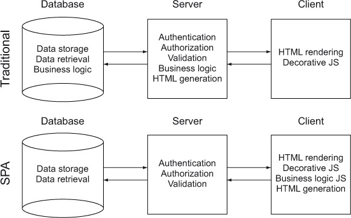

## Class 17: Deployment

---
### Agenda
| Timing | Topic                                    |
| ------ | ---------------------------------------- |
| 5  min | Check In                                 |
| 50 min | Final Project Exercise                   |
| 25 min | Intro to Deployment                      |
| 25 min | Deploying Static Applications            |
| 50 min | Deploying Dynamic Applications           |
| 5  min | Closing Questions & Exit                 |

---
## Looking Ahead
| Lesson No. |        Topic             |
| ---------- | -----------------------  |
|     14     |   APIs                   |
|     15     |   Authentication         |
|   **16**   | **Deployment**           |
|     17     | Wild Card                |
|     18     | Final Project            |
|     19     | Presentations            |

---
## Final Project Exercises
1. Wire Framing
2. User Journey Mapping

--
### Wire Framing
- Sketches/outlines of how the structure of an application's views will look
- useful for prototyping different options

--
### How to Wire Frame
- hand drawn symbols of app components
- layout symbols into the view of our app

--
### Our first Wire Frame

-- 
### Now you make one!
(5 minutes)

--
### Review with your neighbors!
(2 minutes each)

--
### User Journey Mapping
Creating a map of how a user will navigate through and around our applications

--
### Our first User Journeys

--
### Now you make one!
(5 minutes)

--
### Review with your neighbors!
(2 minutes each)

---
## Intro to Deployment

--
### Deployment
process of putting application/website on the internet

--
### Deployment
- user visits URL (`GET` request)
- either:
  - HTML page sent in response
  - Server processes request and sends a response

--
### Types of Applications
1. `static` or `single-page`
2. `dynamic`

--
### Static/Single-page Application
- No server processing
- Application files exist as they'll be sent to the client
- Handlebars to do list & Pixart

--
### Single Page Applications

--
### Dynamic Application
- Server processes request and builds a response
- Tunr (Express handles requests and uses Handlebars to build response)

--
### Review
- What makes an application static?
- What makes an application dynamic?
- What is a Single Page Application?

---
## Deploying Static Applications

--
### GitHub Pages
- Static hosting from within a repository
- Based on Git's branching

--
### Branching
- way to maintain separate/distinct histories within a repository
- kind of like an internal fork

--
### Let's see Branching in action!

--
### Let's deploy to GH Pages

--
### Deploy one yourself!
1. Create a repository in Github
2. Initialize repository locally
3. Set GH Repo as origin
4. Copy To Do to repo, add, commit and push
5. Switch to `gh-pages` branch
6. Push to origin `gh-pages`

--
### Other Static Hosting Options
- surge.sh
- AWS S3
- netlify

---
## Deploying Dynamic Applications

--
### Heroku
- Managed hosting provider
- Workflow is based off of Git
- Great free tier!!

--
### Heroku
- Create an account
- Install/setup Heroku CLI

--
### Deploying to Heroku
- `Procfile`: tell Heroku how to start our application
- `Engine`: tell Heroku what environment to run

--
### Let's see it in Action

--
### Common Gotcha's
1. Set the `buildpack`
2. `heroku create` doesn't set remote
3. Application Error

--
### Set the `buildpack`
`heroku buildpacks:set heroku/nodejs`

--
### Set `heroku` remote
`git remote add heroku <link to heroku remote>`

--
### Application Error
`heroku logs --tail`

--
### Deploy one yourself
1. Create a new repository and copy HackerWall
2. Set port to `process.env.PORT`
3. Write a Procfile
4. Set the Engine and buildpack
5. Create a new app
6. Push to Heroku

